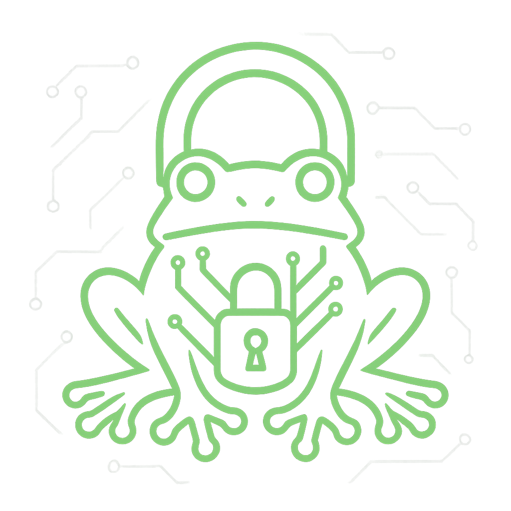

# 🐸 FROGLock — Ghost-Level Hybrid Encryption (v5.4)

**AES-256-GCM + Argon2id + ECCFrog522PP (KEM) — single-file, Windows-focused**




[](https://github.com/victormeloasm/froglock/releases/tag/5.4)
[](#)
[](LICENSE)
[](#)
[](#)

---

## 📥 Download (Windows)

**Ghost build (portable)**  
Go to the v5.4 release page and download the latest portable ZIP:

➡ **https://github.com/victormeloasm/froglock/releases/tag/5.4**

Unzip and run the included **FrogLock.exe** (or similarly named EXE).

* No installer, no admin required.
* Runs in *ghost mode*: no logs, no registry writes by design.
* All cryptographic state lives in memory and is wiped on a best-effort basis.

> ⚠️ If SmartScreen or AV warns (common for fresh unsigned tools):  
> verify the file came from this repo, then click **More info → Run anyway**.

---

## 📚 What FROGLock Does (in one paragraph)

FROGLock encrypts files using **AES-256-GCM** with a random 256-bit **Data Encryption Key (DEK)**.  
That DEK is then sealed using a **mandatory hybrid 2-of-2 scheme**:

1. Your **password**, stretched with **Argon2id** (time-tuned per machine)  
2. One or more **ECCFrog522PP** public keys, via KEM (key encapsulation)

To decrypt, both are required: the **correct password** *and* a matching **FROG private key**.  
There is **no password-only** or **KEM-only** mode.

---

## 🧠 Quick Start (first-time use)

1. **Launch** the app (the portable EXE from the 5.4 release).
2. At the top-right, leave **Paranoid Mode** enabled (recommended).
3. Click **Generate FROG Keypair**:
   * Creates `frog522pp.sk` (private) and `frog522pp.pub` (public, Base64) in the app folder.
   * Your public key is copied to the clipboard automatically.
4. **Share your public key** (`frog522pp.pub` / clipboard Base64 string) with people who should send you encrypted files.
5. To add recipients you want to encrypt **for**:
   * Click **Recipients…**, paste their FROG public keys (Base64, one per line), click **Save**.
6. **Choose a file**:
   * In Paranoid Mode, paste the full path in **Manual Path**.
   * Or temporarily disable Paranoid Mode and use **Browse**.
7. **Enter a strong password** (or click **Generate Password** to create one).
8. Click **Encrypt**.
   * In Paranoid Mode, the output name is **randomized**  
     (e.g. `file_5f3c9b12.aesc` in the same folder).
   * In Standard Mode, the default output pattern is `<file>.aesc`.
   * The clipboard is cleared on encrypt (best-effort).
9. Send the resulting `.aesc` file to your recipient — they’ll need:
   * Their **FROG private key**, and  
   * The **correct password**.
10. On exit, the `frog522pp.sk` file in the app folder is **secure-wiped** (best-effort).  
    Keep an external backup of your private key somewhere safe.

---

## 🖥️ UI Walkthrough

### Header

* **Title + Version + Mode**
  * Shows current version and whether you’re in **Standard** or **Paranoid Mode**.
* **Paranoid Mode** (checkbox or **F9**)
  * Disables the file dialog **Browse** button (fewer shell/MRU traces).
  * Encourages **Manual Path** usage.
  * Uses **randomized output names** for encrypted files.
  * Makes it easier to remove plaintext originals after successful encryption.

---

### Card 1 — File & Password

* **File (dialog)**  
  Standard file picker (disabled in Paranoid Mode).
* **Manual Path**  
  Enter a full path like:  
  `C:\Users\you\Desktop\secret.pdf`
* **Password (hybrid)**  
  The passphrase fed to Argon2id to derive a KEK.
  * **Show** toggles masking on/off.
  * **Generate Password** creates a long, high-entropy password.
  * **Copy Password** copies it to the clipboard (which is cleared on encrypt).
* **Keep original after encrypt**  
  * If unchecked, the app will **try** to delete the plaintext file after a successful encryption
    (best-effort — the OS and filesystem still have the last word).

---

### Card 2 — Key Management (FROG)

* **Recipients…**  
  Manage the set of FROG public keys you encrypt to:
  * Paste Base64 ECCFrog522PP keys (compressed) — one per line.
  * At least one valid recipient is **required** to encrypt.
* **Generate FROG Keypair**  
  * Generates a fresh FROG keypair:
    * `frog522pp.sk` (binary private key, 66 bytes)
    * `frog522pp.pub` (Base64, 1-line public key)
  * Public key is automatically copied to clipboard for sharing.
* **Upload FROG .sk…**  
  * Import an existing private key (for decrypt).
* **Copy Public Key**  
  * Copies your public key (`frog522pp.pub`, Base64 canonical) to the clipboard.
* **Open Keys Folder**  
  * Opens the app directory (where keys live and where `.sk` is secure-wiped on exit).

> 🔑 **Important:** `frog522pp.sk` is wiped from the app folder on exit.  
> Keep a **separate secure backup** if you care about long-term access to encrypted data.

---

### Card 3 — Actions & Status

* **Encrypt** / **Decrypt**  
  * Main operations for `.aesc` files.
* **Clear All**  
  * Resets entries and clears transient UI state.
* **Status text + Progress bar**  
  * Shows what’s happening and percentage done (per file).

---

## 🔐 Encryption Flow (under the hood)

1. **Inputs required**
   * Valid file path.
   * Non-empty **password**.
   * At least **one valid FROG recipient public key** (Base64).

2. **Process**
   1. Generate a random **DEK (32 bytes)**.
   2. Use **Argon2id** (time-autotuned) to derive a **password KEK** using:
      * salt, time (`t`), memory (`m`), and parallelism (`p`) stored in the header.
   3. For each recipient public key:
      * Run **ECCFrog522PP KEM** → recipient-specific **kem-KEK**.
   4. For each recipient:
      * Compute final KEK:  
        `KEK_final = BLAKE2b(pass_KEK || kem_KEK || header_stub)`
      * Encrypt the DEK with AES-GCM using `KEK_final` and attach it as a **hybrid wrap** entry.
   5. Encrypt the file data using **AES-256-GCM**:
      * Single DEK, random nonce (96-bit), per file.
      * Optional random padding applied before final tag.
   6. Write:
      * Header with Argon2 params + hybrid wraps.
      * Ciphertext.
      * GCM tag.

3. **Outputs**
   * A single `.aesc` file containing:
     * Compact JSON header.
     * Ciphertext.
     * Authentication tag.

Sensitive values (`DEK`, `pass_KEK`, `kem_KEK`) are zeroized from memory where possible.

---

## 🔓 Decryption Flow

1. **Inputs required**
   * `.aesc` file.
   * Correct **password**.
   * Matching **FROG private key (`frog522pp.sk`)** available to the app.

2. **Process**
   1. Read header and parse:
      * Magic/versions.
      * Argon2 parameters (`t`, `m`, `p`, `salt`).
      * Hybrid wraps.
      * `wrap_order` and `alg_suite` are **strictly verified**:
        * `wrap_order` must be `"kem_then_pass"`.
        * `alg_suite` must be `"FROG-522PP|AES-256-GCM|Argon2id"`.
   2. Re-derive **password KEK** via Argon2id.
   3. For each hybrid wrap:
      * Use your FROG private key to try to recover **kem-KEK**.
      * Rebuild `KEK_final` and try to decrypt the DEK.
      * Stop at the first successful unwrap.
   4. Decrypt file content with AES-GCM using the unwrapped DEK.
   5. Remove padding and write plaintext to the output file.

3. **Outputs**
   * The original file content (usually original name or `filename.dec` if needed).
   * If no wrap matches:
     * `"Hybrid unlock failed (password or FROG key mismatch)."`

An **AttemptTracker** limits repeated failures for the same file over a time window to slow brute force.

---

## 👁️ Paranoid Mode (recommended)

Paranoid Mode is meant for users who care about minimizing traces:

* **File dialog disabled** — you must paste paths manually.
* **Randomized encrypted filenames** — harder to correlate by name alone.
* Pairs naturally with:
  * Unchecking **“Keep original after encrypt”**.
  * Using strong, unique passwords per file.
  * Storing private keys outside the working directory when not in use.

---

## 🧾 Key Files & Locations

* **`frog522pp.pub`** — public key
  * Base64 canonical, single line.
  * Safe to share.
* **`frog522pp.sk`** — private key
  * 66-byte binary.
  * **Never** share this.
  * Stored in the app directory while running.
  * ACL-locked where supported (owner-only).
  * Secure-wiped on exit (multi-pass overwrite + delete, best-effort).

> 🔁 Make your own offline backup of `frog522pp.sk`.  
> If you lose it, you will **not** be able to decrypt hybrid-encrypted files.

---

## ⚙️ Advanced Options & Environment Variables

* **Adaptive chunk size**
  * From ~64 KiB up to **4 MiB** depending on file size and available RAM.
* **Optional memory-mapped I/O for huge files**
  * Enable with:
    ```bash
    set FROG_MMAP=1
    ```
  * Optional thresholds:
    ```bash
    set FROG_MMAP_MIN_MB=1024   # default 1024 (1 GiB)
    set FROG_MMAP_MAX_MB=4096   # default 4096 (4 GiB)
    ```
* **Optional strict anti-debug**
  * By default the app will **not** kill itself if a debugger is attached.
  * To enable strict anti-debug behavior:
    ```bash
    set FROGLOCK_STRICT_ANTIDEBUG=1
    ```
    With this set, detection of a debugger causes immediate exit.
* **Attempt limiting**
  * Per-file rate limit: too many failed decrypt attempts in a short window will trigger:
    * `"Too many attempts. Wait a bit."`

---

## 🏗️ Build from Source (Windows)

**Requirements**

* Python **3.12+** recommended.
* Git and `pip`.

```bash
git clone https://github.com/victormeloasm/froglock.git
cd froglock

pip install -r requirements.txt
# Optional speedups:
pip install numpy gmpy2 pywin32

python FrogLock.py
````

### Portable EXE (PyInstaller, no UPX)

Example one-liner (PowerShell/CMD):

```bash
pyinstaller --noconfirm --onefile --clean --noupx --noconsole ^
  --name FrogLock ^
  FrogLock.py
```

You can add `--exclude-module numpy --exclude-module gmpy2` to trim size if needed.

---

## 🧪 Security Model (short)

* **Confidentiality & integrity**

  * AES-256-GCM with 96-bit nonce and 128-bit tag.
* **Hybrid secrecy**

  * DEK can only be unwrapped with:

    * Correct **password** (Argon2id, autotuned by time), **and**
    * A valid **FROG private key** matching one of the recipients.
* **No telemetry**

  * No network calls, no phone-home, no analytics.
* **Memory hygiene**

  * Uses `VirtualLock`, `VirtualUnlock`, and `RtlSecureZeroMemory` where available.
  * DEK and KEKs are stored in `bytearray`s and wiped after use.
* **Disk hygiene**

  * Key files and temporary outputs created with restrictive permissions.
  * `frog522pp.sk` secure-wiped from the app folder on exit (best-effort).
* **Header design**

  * JSON-based, compact.
  * Includes Argon2 parameters and hybrid wraps.
  * Avoids leaking plaintext paths or user-identifying metadata.

---

## 🚑 Troubleshooting & Common Errors

* **“Invalid path.”**
  Path is malformed or contains disallowed segments (`..`). Paste a clean absolute path.

* **“Hybrid is mandatory: add at least one FROG recipient.”**
  You tried to encrypt without any valid FROG public keys in the Recipients list.

* **“Missing FROG secret key (.sk).”**
  For decryption, the private key must be loaded (`frog522pp.sk` in the app folder or imported via **Upload FROG .sk…**).

* **“Hybrid unlock failed (password or FROG key mismatch).”**
  Either:

  * The password is wrong, **or**
  * The private key does not match any wrap in the file header.

* **“Too many attempts. Wait a bit.”**
  The per-file rate limit has been reached. Wait a few minutes before trying again.

* **SmartScreen / AV warning**
  Common with new unsigned EXEs. Confirm the hash/source, then use **More info → Run anyway**.

* **“No valid FROG recipients. Check the public keys.”**
  One or more pasted public keys were invalid or malformed. Ensure they are canonical Base64 FROG pubkeys.

---

## 📈 Performance Notes

* AES-GCM usually runs near disk speed on SSD/NVMe.
* Multiple recipients are handled with **parallel KEM wraps**.
* `gmpy2` (optional) speeds up ECC math; `numpy` (optional) speeds up large buffer XOR.
* Argon2id parameters are **autotuned by time (~0.5s)** rather than using a fixed profile,
  adapting to different hardware.

---

## 🔄 Changelog (v5.4 — Ghost Hardened)

**Key security changes compared to v5.3:**

* **Unbiased FROG key generation**

  * `frog_privkey_generate()` now uses rejection sampling to generate keys uniformly in `[1, n-1]`
    instead of relying on `k % n`.

* **Time-based Argon2id autotune**

  * Argon2id calibration is now based on real execution time (target ~500 ms),
    choosing `{t, m, p}` according to the machine’s capabilities.

* **Stricter hybrid metadata**

  * `pass_params_make()` explicitly sets:

    * `wrap_order = "kem_then_pass"`
    * `alg_suite = "FROG-522PP|AES-256-GCM|Argon2id"`

* **Strict validation on decrypt**

  * `decrypt_stream()` refuses headers whose `wrap_order` or `alg_suite` do not match the expected values.

* **Improved key zeroization**

  * Both the DEK **and** the password-derived KEK (`kek_pass`) are now explicitly locked and wiped after use.

* **Configurable anti-debug**

  * Anti-debug behavior is now controlled by the `FROGLOCK_STRICT_ANTIDEBUG` environment variable
    instead of always killing the process when a debugger is detected.

* **UI**

  * Window size adjusted for a more compact look (no overly stretched layout).
  * All existing GUI features preserved (Recipients manager, keypair generation, Paranoid Mode, etc.).

---

## ❓ FAQ

**Q: Can I decrypt with just the password?**
No. Hybrid is mandatory: you need **both** the correct password and a matching **FROG private key**.

**Q: Where should I store my private key?**
Keep `frog522pp.sk` in the app folder only while using FrogLock and maintain a **separate encrypted backup** offline.

**Q: What happens if I lose my `.sk` file?**
You will not be able to decrypt hybrid-encrypted files. There is no backdoor or recovery mechanism.

**Q: Does FROGLock remove all traces from the system?**
It avoids logs, registry writes, and trims clipboard and temp usage, especially in Paranoid Mode.
However, OS-level traces (recent files, AV caches, pagefile, etc.) are outside the app’s control.

---

## 📜 License & Disclaimer

FROGLock is released under the **MIT License** — see [LICENSE](LICENSE).

This software is provided **“as is”**, without warranty of any kind.
Use it responsibly. You are solely responsible for backups, key management, and secure usage.


