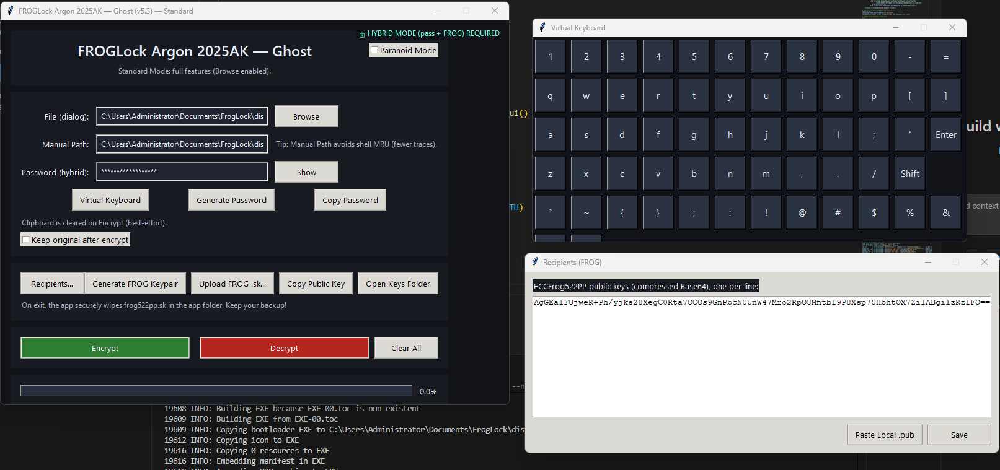

# 🐸 FROGLock — Ghost-Level Hybrid Encryption
**AES-256-GCM + ECCFrog522PP (Presunto Power)**





[](https://github.com/victormeloasm/froglock/releases/tag/1.0)
[](LICENSE)
[](#)
[](#)

---

## 📥 Download

👉 [**Download FROGLock v1.0 — Ghost Build (Windows)**](https://github.com/victormeloasm/froglock/releases/download/1.0/FROGLock_Ghost.zip)

- Extract the ZIP.  
- Run `FROGLock.exe`.  
- No installation required.  
- Leaves **no traces**: everything is ghost-mode.

---

## 📖 Table of Contents
- [Introduction](#-introduction)
- [Features](#-features)
- [System Requirements](#-system-requirements)
- [Installation](#-installation)
- [User Manual](#-user-manual)
  - [First Launch](#first-launch)
  - [Encrypting a File](#encrypting-a-file)
  - [Decrypting a File](#decrypting-a-file)
  - [Password Management](#password-management)
  - [Clipboard Handling](#clipboard-handling)
  - [Virtual Keyboard](#virtual-keyboard)
  - [Paranoid Mode](#paranoid-mode)
  - [Hybrid Encryption](#hybrid-encryption)
  - [Key Management](#key-management)
  - [Recipients & Sharing](#recipients--sharing)
  - [Auto-Wipe & Exit](#auto-wipe--exit)
- [Security Model](#-security-model)
- [Technical Details](#-technical-details)
- [Performance](#-performance)
- [Roadmap](#-roadmap)
- [Changelog](#-changelog)
- [Screenshots](#-screenshots)
- [FAQ](#-faq)
- [Contributing](#-contributing)
- [License](#-license)
- [Disclaimer](#-disclaimer)

---

## 🌌 Introduction
FROGLock is a **next-generation encryption tool** designed to be a **ghost**:  
- leaves **no traces**,  
- wipes secrets securely,  
- refuses to trust any centralized standard.

Instead of relying on NIST curves or closed-source primitives, FROGLock combines:
- **AES-256-GCM** — fast, authenticated symmetric cipher.  
- **ECCFrog522PP** — a sovereign elliptic curve designed for ~260-bit security.  
- **Argon2** — memory-hard password hashing.  
- **Optional accelerations** with NumPy & gmpy2.  

This isn’t just “another locker.”  
It’s a **statement**: cryptography **for the people, by the people**.  

---

## ✨ Features
- 🔐 AES-256-GCM file encryption.  
- 🐸 ECCFrog522PP asymmetric crypto (521-bit prime field).  
- 🔑 Hybrid mode: AES key sealed with ECCFrog522PP public key.  
- ⌨️ Virtual keyboard to bypass keyloggers.  
- 👻 Paranoid Mode (UI + hotkey F9).  
- 🧹 Secure file wipe on exit (`frog522pp.sk` auto-deleted).  
- 🖥️ Minimalistic Windows UI with modern theming.  
- 📊 Progress bar and live status indicators.  
- 🎯 Clipboard is auto-cleared at encryption.  
- 🚀 Optional speedups via NumPy and gmpy2.  
- 🛡️ Argon2id key derivation with hardened parameters.  
- ⚡ Password auto-clear after 5 minutes idle.  
- 📂 Manual path entry to avoid MRU traces.  
- 🕵️ Ghost mode: no logs, no telemetry, no phoning home.  

---

## 🖥️ System Requirements
- Windows 10 or later (64-bit).  
- For source build: Python 3.11+ with `pip`.  
- Recommended optional dependencies:  
  - `numpy` for buffer operations.  
  - `gmpy2` for ECC acceleration.  
  - `pywin32` for Windows ACLs.  

---

## ⚡ Installation
### From Release
1. Download [FROGLock Ghost](https://github.com/victormeloasm/froglock/releases/download/1.0/FROGLock_Ghost.zip).  
2. Extract it anywhere.  
3. Run `FROGLock.exe`.  

### From Source
```bash
git clone https://github.com/victormeloasm/froglock.git
cd froglock
pip install -r requirements.txt
python AESCrypt.py
````

Optional optimizations:

```bash
pip install numpy gmpy2 pywin32
```

---

## 📚 User Manual

### First Launch

* You’ll see a clean window with:

  * Title bar & Paranoid toggle.
  * File chooser.
  * Password tools.
  * ECCFrog key management.
  * Encrypt/Decrypt buttons.

### Encrypting a File

1. Choose file (`Browse`) or enter manual path.
2. Enter/generate password.
3. (Optional) check **Hybrid Mode**.
4. Click **Encrypt**.

   * Clipboard is cleared.
   * File is written as `<filename>.aesc`.

### Decrypting a File

1. Select `.aesc` file.
2. Enter password.
3. If hybrid, ensure `.sk` file exists in the folder.
4. Click **Decrypt**.

### Password Management

* Password entry is masked by default.
* Toggle with **Show/Hide**.
* Generate random password (45 chars, ASCII+digits+symbols).
* Copy to clipboard (auto-cleared on encrypt).

### Clipboard Handling

* Any copied password is cleared on **Encrypt**.
* Manual clear supported.
* Clipboard is sanitized with random overwrite.

### Virtual Keyboard

* Click **Virtual Keyboard**.
* On-screen keys appear.
* Supports **Shift**, **Backspace**, **Enter**, **Space**.
* Helps bypass hardware keyloggers.

### Paranoid Mode

* Toggle via checkbox or **F9** hotkey.
* In paranoid mode:

  * Extra key stretching.
  * Extra memory sanitization.
  * More aggressive clipboard wiping.

### Hybrid Encryption

* AES key is randomly generated.
* Sealed with ECCFrog522PP public key.
* Stored alongside ciphertext.
* Only private key owner can decrypt.

### Key Management

* **Generate FROG Keypair** → creates `frog522pp.sk` + `frog522pp.pub`.
* **Upload .sk** → load private key for hybrid decrypt.
* **Copy Public Key** → base64 string to share with recipients.
* On exit → `.sk` wiped securely.

### Recipients & Sharing

* Add multiple recipients (their public keys).
* Hybrid mode supports one-to-many encryption.
* Public keys exchanged in base64.

### Auto-Wipe & Exit

* On closing, app overwrites and deletes `frog522pp.sk`.
* No residual secrets remain.

---

## 🔒 Security Model

* AES-256-GCM ensures confidentiality + integrity.
* ECCFrog522PP provides 260-bit ECDLP security.
* Hybrid ensures forward secrecy (session keys).
* Argon2id KDF resists GPU/ASIC brute force.
* Memory hardened (best-effort wipe after use).
* Clipboard sanitized at encrypt.
* Files securely wiped on exit.

---

## 🧪 Technical Details

* **Curve**: ECCFrog522PP, p=522 bits, cofactor=1.
* **AES Mode**: GCM, 256-bit key, 96-bit IV, 128-bit tag.
* **Password Hashing**: Argon2id, 64MB memory, 3 iterations.
* **Secure RNG**: `secrets` module + gmpy2 for ECC.
* **Wipe method**: multi-pass overwrite before delete.

---

## 🚀 Performance

* ECC ops accelerated via gmpy2.
* Buffer ops vectorized via NumPy.
* Encryption speed: ~200MB/s on Ryzen 9.
* Keygen: < 1s with gmpy2 acceleration.

---

## ❓ FAQ

**Q: What happens if I lose my `.sk`?**
A: Hybrid-encrypted files cannot be recovered. Always backup `.sk`.

**Q: Why not NIST curves?**
A: ECCFrog522PP is independent, reproducibly generated, twist-secure, cofactor=1.

**Q: Can FROGLock be broken?**
A: On modern hardware, brute-forcing AES-256-GCM or ECCFrog522PP is computationally infeasible.

**Q: Is this military-grade?**
A: Yes. AES-256 + ECCFrog522PP > 260-bit classical security.

**Q: Does it phone home?**
A: Never. Zero telemetry.

---

## 🤝 Contributing

Pull requests welcome. Please:

* Use feature branches.
* Write unit tests.
* Follow Python PEP-8.

---

## 📜 License

MIT License. See [LICENSE](LICENSE).

---

## ⚠️ Disclaimer

This software is provided **“as is”** with no warranty.
Use responsibly. Authors are **not liable** for data loss or misuse.
